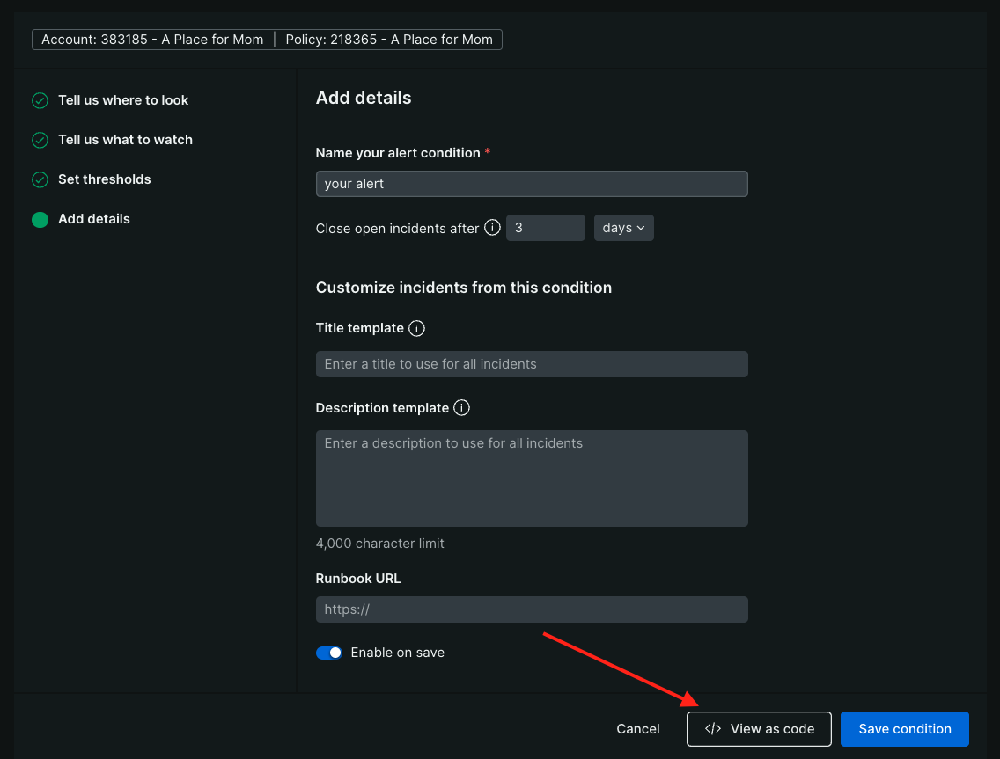
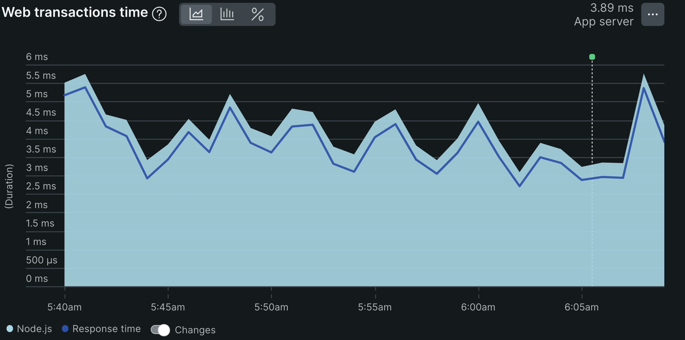
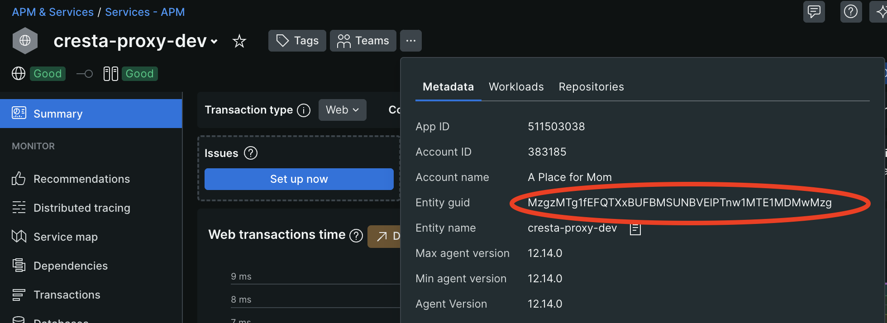

# APFM NestJS Template

An opinionated, batteries included, template for rapidly building and deploying new NestJS applications at A Place For Mom.

[NestJS](https://nestjs.com/) is a TypeScript framework that can be used for both API and backend worker services,
that includes support for GraphQL, Dependency Injection, Swagger, Scheduling (Cron), and many other features that we
would otherwise have to build ourselves.

Features:

- Logger logs in a standard cross application manor, improving cross application searching
- Http Client with Retries and correlation id support
- Standard Response Decorator, to improve standards across APFM applications
- Status Endpoints

## APFM Modules Used

The following APFM developed modules are included in this repo. When expanding functionality or fixing bugs in these areas
please consider submitting a pull request to the appropriate module so that everyone using this template can benefit.

- [DateTime](https://github.com/aplaceformom/apfm-datetime)
- [HTTP Client](https://github.com/aplaceformom/apfm-http-client)
- [Logger](https://github.com/aplaceformom/apfm-logger-typescript)
- [MockFill](https://github.com/aplaceformom/mockfill)

## Local Development

Required:

- [pnpm](https://pnpm.io/)

Recommended:

- [nvm](https://github.com/nvm-sh/nvm)
- [editorconfig](https://editorconfig.org/) for your text editor
  - Many editors have built in support, and many more have plugins. [Editor Support](https://editorconfig.org/#pre-installed)

```shell
# Assuming you have an exported ENV var called $GIT_HOME, otherwise, where ever you keep your git repos
cd ${GIT_HOME}

# clone the repo
git clone git@github.com:aplaceformom/apfm-nestjs-template.git

cd apfm-nestjs-template

# If you have `nvm` configured to automatically run, it will select/install the proper version of node. otherwise run
nvm install # if you don't already have the correct version of node installed
nvm use # to select the correct version of node

# Install node modules
pnpm install
```

## Local Environmental Variables

The template, and many modules, utilize ENV vars for application configuration. To facilitate loading the proper environment
variables we are utilizing local environmental files.

`.env-local-dev` : Any ENV variable that should be committed to the repo. This would be any configuration that we need to run the application locally, run tests, etc.

`.env-local-dev-secrets` : Any secret ENV variable that would be injected at runtime. This would be API keys, passwords, credentials, etc.

example `.env-local-dev` (secrets would work the same way):

```shell
APP_NAME=local_app
APP_VERSION=local_dev
APFM_LOG_LEVEL=debug
```

### Automatically loading ENV variables

The template has a `.envrc` file setup, which can be utilized by DirEnv.

Direnv can be installed via homebrew:

```shell
brew install direnv
```

Once `direnv` is installed you can setup the hooks in your `.bashrc` or `.zshrc` files per the [documentation](https://direnv.net/docs/hook.html).

bashrc:

```shell
if [[ -x $(command -v direnv) ]]; then
  eval "$(direnv hook bash)"
fi
```

zshrc:

```shell
if [[ -x $(command -v direnv) ]]; then
  eval "$(direnv hook zsh)"
fi
```

Other shells are supported, but `BASH` and `zsh` are the most common.

For security, the first time you enter a directory with a `.envrc` file, or any time that it is updated, you'll need to run `direnv allow .`.

The `.envrc` file provided in the template is a simple, bare-bones files. It can run any bash script, thus, could install or do anything you
need to setup an environment for the current directory, including managing tooling like python environments, setting up other hooks, functions.

For more complicated tooling management a tool like [ASDF](https://asdf-vm.com/) may be more appropriate.

## Project Structure

There are 2 common ways to setup a NestJS application. By Module and by file type. We've chosen to structure the
project by module so that each module is a self contained feature. This allows us to more easily separate features that
are added to a project from original template code, allowing teams to more easily update the underlying template.

```text
./src
  config      : All files related to application configuration
  module      : Application Module lives in the root
    common    : Features / modules that are commonly used across modules
      model   : Base responses, entities, types, and models that are common to all modules
      util    : common utilities that will be used across modules
    example   : An example module
    status    : Default status information about the project, such as a ping and health-check endpoints
    %feature% : Feature Modules

./test        : Tests are here based on directory structure above.
  module      :
    %feature% : Your modules feature tests go here. Continue the directory structure down.
```

The Feature module directory should look like:

```text
feature-name
   controller : All API Controllers
   middleware : Any Express middleware that is needed for the feature
   model      : Any models that are required
     dto      : Any Data Transformation Objects. These are the inputs from POST / mutation requests, and provide any logic for transformation
   service    : Any services that the module needs
   util       : Any utility functions and classes that the module needs
   module.ts  : the module definition that will be included into the `application.ts` module.
```

**NOTE** You can have many feature modules in a project. They should be logically separated for organization.

## Configuration

All configuration is handled in a single file, `config.ts`. This file defines a configuration type which is made available via `applicationConfig`.

It is recommended, and encouraged, that all configuration be passed into this object via ENV vars. These ENV vars
should then be processed and transformed to the appropriate type. That is, if you pass a number via ENV vars, convert
it from a string to a number before making it available to the application in the configuration.

To dependency inject the config into a class you can use the `APP_CONFIG` injection type on the parameter in the
class constructor:

```typescript
@Inject("APP_CONFIG") private readonly config: Config
```

### ENV Variables

#### Required

- `APP_NAME` : name of the application
- `APP_VERSION` : Version of the application. Recommend using GitSha or github release version
- `NEW_RELIC_APP_NAME` : Application name in NewRelic. This will vary by ENV, and will likely be `APP_NAME-ENV`. Example: `my-app-prod` for production, or `my-app-qa` for QA.
- `NEW_RELIC_LICENSE_KEY`: The New Relic License Key

#### Optional

- `APFM_LOG_LEVEL` : Optional : String : default `info`. Valid values "trace", "verbose", "debug", "info", "warn", "error", "silent", "fatal"
- `APFM_LOGGER_JSON` : Optional : Boolean : Log as JSON (default) or plain text. Useful for local development. `true` for json logging, `false` for plain text.
- `PORT`: Optional: Integer : Default = 3000
- `NEW_RELIC_LOG_LEVEL`: New Relic's log level. Default `info`. It is recommended to not change this.
- `NEW_RELIC_ERROR_COLLECTOR_IGNORE_ERROR_CODES`: Which API Status codes NewRelic will alert as Errors. It is RECOMMENDED that this be set to ignore 4xx errors, which are client errors.
  - Recommendation: `400, 401, 402, 403, 404, 405, 406, 408, 409, 410, 411, 412, 413, 414, 415, 416, 417, 418, 429`

### ResponseDecorator

By default an additional metadata object similar to the below is being added to all responses by the response-decorator middleware.

```json
{"meta":{"build":"0c856c28","name":"cresta-proxy","version":"rc-1.0.5","time":1,"time
stamp":"2025-05-14T16:34:58.664Z"}}
```

This information helps with debugging and understanding which version of the service is impacted by a particular issue.

Should you have routes that you would like to exclude from this handling (i.e. a WebSocket, or Server-Sent Events endpoint) you can add
these paths to config.responseDecorator.ignoreUrlPaths as an array of strings. This will remove them from handling by the decorator.

## Running

To run the NestJS application locally:

```shell
pnpm run start:dev
```

This will start the application up in watch mode, so that as files change the application will restart.
It will also set any required ENV variables and set logging to `debug`.

Running the application in AWS production:

```shell
pnpm run start:prod
```

This will start the application with NewRelic. The required ENV vars must be set.

Running the application locally, under a REPL:

```shell
pnpm run repl
```

This will allow you to run modules in the app interactively, and supports async / await.

## Alerting

Alerts should be managed by terraform, in code. The template provides some standard alerts that handle deviation of memory, errors, and throughput.

Simple alerts can be done as follows

1. By completing the [Bootstrapping Permissions](https://aplaceformom.atlassian.net/wiki/spaces/DPLAT/pages/3593076789/Self+Service+-+Getting+Started#Bootstrapping-Permissions)
   your app should permissions
1. Modify the `infrastructure/alerts/terraform.tf` backend key to use your repository's name.
1. Container metrics require filtering on the ECS cluster. If app not defined to `default` ecs cluster update to proper cluster
1. Search for `apfm-nestjs-template` and replace with your app's name (repository's name)
1. Search for `<INSERT_ALERT_POLICY_ID>` and replace with your team's [Alert Policy Id](https://onenr.io/0MR2x2P92QY)
1. Search for `yourservicename` and replace with your repo's name without dashes (terraform resource names shouldn't have dashes)
1. Search for `<INSERT_NR_GUID>` and replace with your Service APM Entity Guid

This can be found by navigating to your service's Services - APM Dashboard
Clicking the `...` and copying the Entity Guid

As you find more alerts that make sense for your application they can be easily added by using the "New Alert Condition" found [here](https://onenr.io/0VwgEeLxMjJ).

- Follow the guided steps to create an alert
- After completing the steps, click "View As Code"
- select Terraform



Note: The application will need to be deployed to production before the Entity Guid can be retrieved.

## Swagger Documentation

The Swagger plugin is supported out of the box and is available at: [http://localhost:3000/api/documentation](http://localhost:3000/api/documentation)

The Swagger Documentation is built at runtime and is dependant on correctly configuring your APIs using
NestJS's decorators.

## Validation Pipelines

[NestJS Provides validation](https://docs.nestjs.com/techniques/validation) support for types being sent to APIs.

Basic validation support with examples are provided in the `validators` directory and `example-cat.dto.ts` files.

## SonarQube

The github actions have SonarQube enabled to run on Pull Requests. When creating a repo with this template
change the `sonar.projectKey` in the `sonar-project.properties` file to the new project's name.

Since we use <https://github.com/aplaceformom/mockfill> for testing we've added the verify function that it provides as an assert function.

See [Documentation](https://aplaceformom.atlassian.net/wiki/spaces/DPLAT/pages/3455680513/Getting+Started) for more details

## Deployment

Services deployed with Platform's Self Service Infrastructure. [See Confluence](https://aplaceformom.atlassian.net/wiki/spaces/DPLAT/pages/3593076789/Self+Service+-+Getting+Started)
since you will need to do a couple of prerequisites before deployments happen.

Search for `${YOUR_SERVICE_NAME}` and replace with your service name.

### Deployed Environments

- Dev - `${repo-name}$.us-west-2.dev.apfmtech.com`
- QA - `${repo-name}$.us-west-2.qa.apfmtech.com`
- Prod - `${repo-name}$.us-west-2.prod.apfmtech.com`

### Secrets

In the task definitions secrets can be added to the `container.secret` array.

The values are pulled from parameter store.

Note: We have standardized on snake_case for YOUR_SERVICE_NAME here even though most repos are kebob-case. This is mainly because database names need to be snake_case so easier to
standardize on one style.

```json

"secrets": [
  {
    "name": "DATABASE_PASS",
    "valueFrom": "/${YOUR_SERVICE_NAME}/secrets/db_pass_app"
  },
  {
    "name": "DATABASE_PASS_READONLY",
    "valueFrom": "/${YOUR_SERVICE_NAME}/secrets/db_pass_readonly"
  }
]
```

### Deployment Markers

A handy feature in New Relic is the ability to add markers to all APM graphs when a
deployment occurs. This allows you to visually compare metrics pre and post deploy and
for external teams to easily determine when a service was last deployed.



In order to add these markers, you will need to call the `newrelic/deployment-marker-action`
action from your workflow at the end of your deployment. An example of this can be found in
the GitHub actions of [cresta-proxy](https://github.com/aplaceformom/cresta-proxy/blob/5ec9efbc2f8bc1eb4db521bbf698b5735f30dc9e/.github/workflows/dev.yml#L88)

Note that this action requires a New Relic Entity Guid. This can be retrieved from the APM page
of your application by clicking the ellipsis button next to the name of your application as illustrated in the image below:



Note, that this Entity GUID will be different for each environment, so you will need
three different values corresponding to each environment for your workflows.

For full details on this action including additional inputs you can reference the [New Relic Documentation](https://github.com/newrelic/deployment-marker-action).

## Tokens

### Local Node Auth Token

In order to access the private npm repository, which is where we save APFM NPM Modules, you'll need a Github personal access token.

The `.npmrc` file contains the following

```shell
@aplaceformom:registry=https://npm.pkg.github.com
//npm.pkg.github.com/:_authToken=${NODE_AUTH_TOKEN}
```

- Log in to GitHub and navigate to Settings > Developer settings > Personal access tokens. Then click Generate new token or visit the following link: [Generate a new token](https://github.com/settings/tokens/new).
- Ensure the token has the repo and packages scopes checked.
- Copy the generated token to your clipboard, you won't be able to retrieve it again.
- On the token list page, click the Enable SSO button and authorize A Place for Mom.
- Add the following line to your `.bashrc` or `.zshrc` file (located in your home directory, the prefixed `.` means the files are hidden, so you may not be able to navigate to
  them normally):

```shell
export NODE_AUTH_TOKEN="YourTokenHere"
```

- Restart your terminal or reload your shell configuration by running:

```shell
# If using ZSH, the default on MacOS.
source ~/.zshrc

# If using BASH, the default on most Linux distros, including WSL2 on windows
source ~/.bashrc
```

- Verify that the environment variable is set correctly by running the following command:

```shell
echo $NODE_AUTH_TOKEN
```

You should see your token printed in the terminal.

### Tokens in GitHub Actions

Organization secrets are used to provide GitHub Actions with the necessary
access. The same `NODE_AUTH_TOKEN` is available in GitHub Actions, allowing
the `.npmrc` configuration to work both locally and in Actions, provided the
steps outlined in the above guide are followed.

In workflow files, secrets can be accessed in the workflow YAML using `${{ secrets.NODE_AUTH_TOKEN }}`.
Configuring repository secrets or viewing organization secrets can be done by navigating to Settings > Security > Actions.
